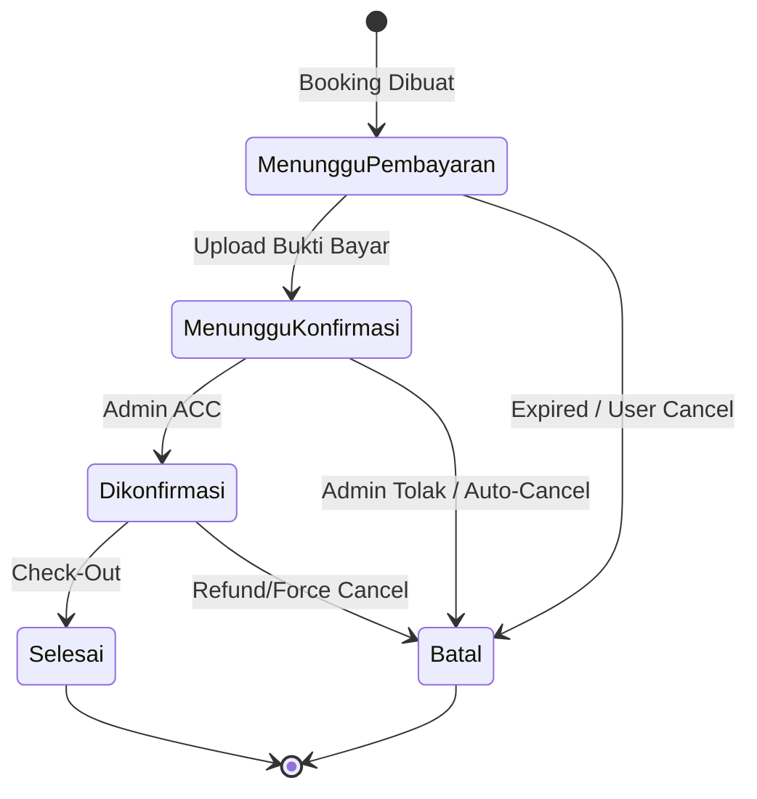
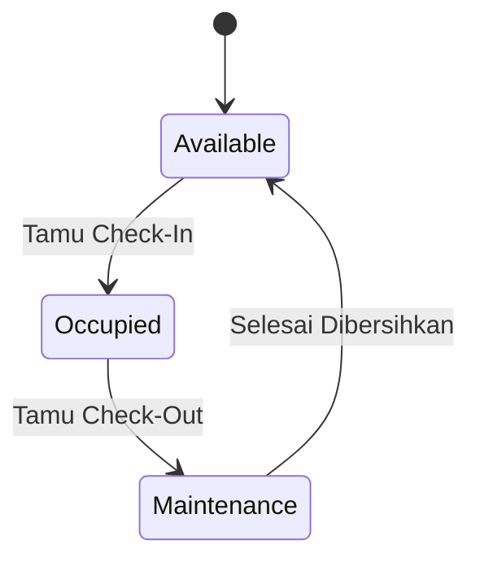

# Alur Lengkap Sistem Reservasi Clarista Homestay

Dokumen ini menjelaskan alur bisnis pemesanan kamar dari awal sampai akhir, mencakup proses Online (Via App/Web) dan Offline (Walk-in).

## Status Utama
Sistem ini memantau status di tiga entitas berbeda yang saling berkaitan:
1.  **Pemesanan (`status_pemesanan`)**: Status transaksi bisnis dengan customer.
2.  **Pembayaran (`status_verifikasi`)**: Status validitas uang masuk.
3.  **Penempatan / Kamar (`status_penempatan` & `status_unit`)**: Status fisik kamar dan okupansi.

---

## 1. Alur Reservasi Online (Customer)

### A. Pencarian & Pemilihan Kamar
1.  **Customer** melakukan pencarian tanggal Check-in & Check-out.
2.  **Sistem** mengecek ketersediaan menggunakan logika: `Total Kamar Fisik - Kamar Terbooking di Tanggal Tersebut`.
3.  **Output**: List tipe kamar yang masih memiliki sisa kuota (misal: "Deluxe: Sisa 2").

### B. Pembuatan Booking (Checkout)
1.  **Customer** memilih kamar dan menekan "Booking".
2.  **Sistem**:
    *   Memilih Unit Kamar fisik secara acak/berurutan dari stok yang `available`.
    *   Mengunci Unit Kamar tersebut (soft lock) dalam database.
    *   Membuat data **Pemesanan** dengan status `menunggu_pembayaran`.
    *   Membuat data **Penempatan Kamar** dengan status `pending`.
3.  **Timer**: Booking akan expired dalam 1 jam jika tidak dibayar (tergantung setting `expired_at`).

### C. Pembayaran
1.  **Customer** melakukan transfer dan upload bukti bayar.
2.  **Sistem**:
    *   Membuat data **Pembayaran** dengan status `menunggu_verifikasi`.
    *   Mengupdate **Pemesanan** menjadi `menunggu_konfirmasi`.

### D. Verifikasi (Oleh Admin/Owner)
1.  **Admin** mengecek bukti pembayaran.
2.  **Action**:
    *   **Jika Valid**: Admin klik "Terima/Konfirmasi".
        *   **Pemesanan** berubah jadi `dikonfirmasi`.
        *   **Pembayaran** (opsional) berubah jadi `verified`.
        *   Tiket booking diterbitkan ke user.
    *   **Jika Invalid**: Admin klik "Tolak".
        *   **Pemesanan** berubah jadi `batal`.
        *   **Penempatan Kamar** dibatalkan (unit kamar kembali `available` untuk orang lain).

### E. Check-In (Kedatangan)
1.  **Tamu** datang ke resepsionis.
2.  **Admin** melakukan proses Check-In di sistem.
3.  **Sistem**:
    *   Mengupdate **Penempatan Kamar** dari `pending` menjadi `assigned` (atau `checked_in` jika kode sudah diupdate).
    *   Mencatat `check_in_aktual` (waktu real-time).
    *   Mengubah status fisik **Unit Kamar** menjadi `occupied`.

### F. Check-Out (Kepulangan)
1.  **Tamu** mengembalikan kunci.
2.  **Admin** klik "Check-Out".
3.  **Sistem**:
    *   Mengupdate **Penempatan Kamar** menjadi `checked_out`.
    *   Mengupdate **Pemesanan** menjadi `selesai` (jika semua kamar dalam pesanan sudah check-out).
    *   Mengubah status fisik **Unit Kamar** menjadi `maintenance` (kotor/perlu dibersihkan).

### G. Pembersihan (Housekeeping)
1.  **Housekeeping** membersihkan kamar.
2.  **Admin** mengubah status Unit Kamar dari `maintenance` menjadi `available`.
3.  **Sistem**: Kamar siap dijual kembali.

---

## 2. Alur Reservasi Offline (Walk-in)
Fitur `storeOffline` digunakan admin untuk tamu yang datang langsung tanpa booking online.

1.  **Admin** Input Data: Nama Tamu, No HP, Tanggal, Lama Menginap, Tipe Kamar.
2.  **Sistem**:
    *   Otomatis membuat/mencari User berdasarkan No HP (Dummy User).
    *   Membuat **Pemesanan** langsung dengan status `dikonfirmasi`.
    *   Membuat **Pembayaran** langsung dengan status `verified` (asumsi bayar tunai/EDC di tempat).
    *   Membuat **Penempatan Kamar** langsung dengan status `assigned` (Langsung Check-In).
    *   Mengubah status Unit Kamar jadi `occupied`.
3.  **Hasil**: Tamu langsung masuk kamar tanpa proses verifikasi manual.

---

## Diagram State (Mermaid)

### Siklus Hidup Pemesanan (`status_pemesanan`)

### Siklus Hidup Unit Kamar (`status_unit`)

